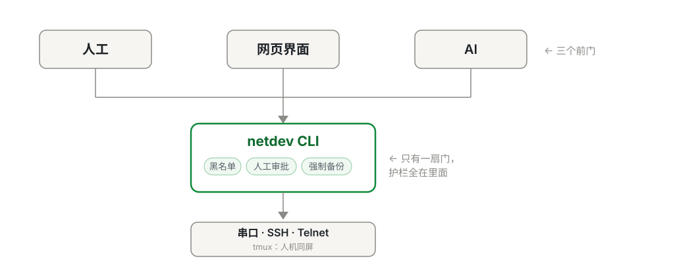
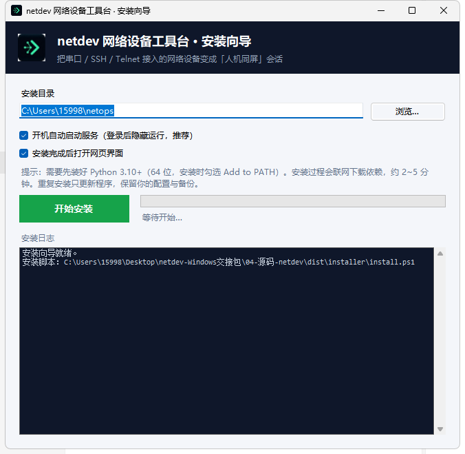
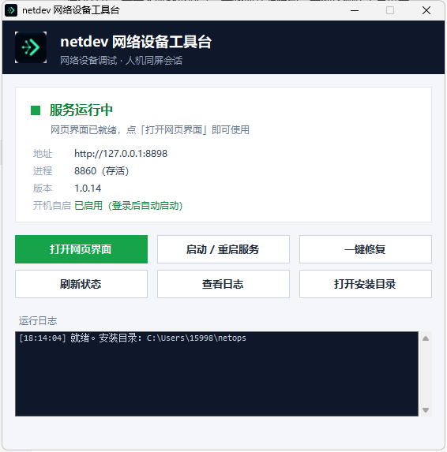

# netdev — Network Device Debugging Console

[简体中文](README.md) · [Contributing](CONTRIBUTING.md) · [Security](SECURITY.md) · [Changelog](CHANGELOG.md) · [Code of Conduct](CODE_OF_CONDUCT.md) · [MIT License](LICENSE)

A **macOS / Windows** terminal for debugging network gear, built around one idea:
**the AI and the human must look at the same screen, through the same door.**

Serial console, SSH and Telnet all converge into a single CLI. That CLI is the
*only* way to touch a device — the AI has no side door. Every guardrail
(blacklist, human approval, forced backup, per-line verification) lives in that
one path, so the AI cannot route around it.



## Why

Debugging network equipment means watching a screen that scrolls by, waiting for
a prompt, and being able to scroll back. Doing that through an AI wrapper usually
means the AI is *blind* — it sends a command, gets text back, and the human sees
nothing.

netdev puts both of you in the same pane (tmux on macOS, a built-in daemon on
Windows). The AI can read what's on screen and type into it; you watch it happen
and can take over at any moment.

## Windows: installs and runs like a normal app

The Windows build ships a **graphical installer** — unzip, double-click
`netdev-install.exe`, pick a folder, click Install. No console window at any point;
you get Start-menu and desktop shortcuts with a proper icon.



**Your daily entry point is the "netdev toolbox"** — a console-free WinForms window
that re-checks the service every 3 seconds (TCP *and* `/api/health`, not just the PID
file) and shows whether it's up, the address, PID, version, and autostart state.



- **The service starts itself at login** — written to the per-user Startup folder
  (works without admin), launched hidden, no console flash.
- **If it won't start, one click fixes it** — the toolbox's "One-click repair" button
  (and a separate Start-menu shortcut of the same name) runs the bundled
  `一键体检.ps1 -Fix`: fills in missing config, clears zombie processes holding the
  port, restarts the service, repairs deps, re-creates autostart. It works even when
  the toolbox itself won't open.

> Full steps: [Windows install notes](dist/installer/README-Windows安装说明.txt)
> (Chinese). Bundles are on [Releases](https://github.com/493939799-dot/netdev/releases).

## Features

- **Three ways in** — Serial Console / SSH / Telnet
- **Shared screen** — human and AI read and write the same pane, with scrollback (tmux on macOS; a built-in pane daemon + serial bridge on Windows)
- **Four gates on every write** — blacklist → human approval → forced backup → per-line push with verification
- **Fail-closed** — if the approver can't be reached, the write is *refused*, not allowed
- **Vendor auto-detection** — sends `display version`, recognizes Huawei / H3C / Ruijie / Cisco / Maipu from the banner. You don't fill in a platform code
- **Metrics that admit ignorance** — an unparsed metric shows `—`. It never invents a `0`
- **Learn once, use forever** — a metric command the device rejects is probed once, then cached to `config/cmd-cache.json`
- **AI over a direct connection** — talks straight to any OpenAI-compatible API (DeepSeek / OpenAI / OpenRouter / your own gateway). One API key, no extra CLI, no background process. AI can also be switched off entirely
- **AI status panel** — ⟳ quick scan (13 metrics collected silently, then AI turns structured facts into findings → actions) and 🔍 deep check (the AI plans a set of **read-only** commands, runs them all quietly, and diagnoses from real output — for those "something feels off" moments). Design notes: [docs/monitor-status-design.md](docs/monitor-status-design.md)
- **Snapshots** — semantic diff (not raw line-by-line), restore-after-review, recycle bin for deletes
- **Self-check** — `./netdev doctor` tells you what's wrong on this machine
- **A web UI you can start with one command** — `netdev ui`

## Requirements

**macOS**

- `/dev/cu.*` device names, `osascript`, `security`, and `tmux` (`brew install tmux`)
- Python **3.10+**
- A USB-Console adapter (FTDI / CH340 / CP210x) for serial, if you use serial

**Windows 10/11 x64**

- Python **3.10 ~ 3.12** (x64), with "Add python.exe to PATH" ticked
- A USB-Console adapter (FTDI / CH340 / CP210x) for serial, if you use serial
- No tmux needed — the shared-screen daemon is built in

## Install

### Windows: graphical wizard (recommended)

Download `netdev-windows-x64-installer.zip` from
[Releases](https://github.com/493939799-dot/netdev/releases), unzip it, and
double-click **`netdev-install.exe`**. Pick a folder, tick "start at login / open
UI when done", click Install (about 2–5 min).

Then: Start-menu / desktop **"netdev toolbox"** → open <http://127.0.0.1:8898>.
Uninstall:
`powershell -ExecutionPolicy Bypass -File "%USERPROFILE%\netops\uninstall.ps1"`
(config and backups are kept; add `-Purge` to remove everything).

<details>
<summary>Build the Windows bundle yourself</summary>

```powershell
powershell -ExecutionPolicy Bypass -File dist/build_bundle.ps1 -Out .
# → netdev-windows-x64-installer.zip + .sha256
```

`build_bundle.ps1` first calls `dist/installer/build_exes.ps1`, which uses the
.NET Framework compiler `csc.exe` (bundled with Windows) to compile
`LauncherStub.cs` / `InstallerStub.cs` into `netdev-toolbox.exe` /
`netdev-install.exe` (icon from `netdev.ico`), then packs them with `install.ps1`
and `一键体检.ps1`. The `.exe` files are build artifacts and are gitignored.
</details>

### macOS: prebuilt installer (recommended)

**[⬇ Download netdev-macos-arm64-installer.tar.gz](https://github.com/493939799-dot/netdev/releases/latest/download/netdev-macos-arm64-installer.tar.gz)** (~33 MB)

```bash
tar -xzf netdev-macos-arm64-installer.tar.gz
cd netdev-macos-arm64-installer
bash install.sh --dry-run     # preview (writes nothing)
bash install.sh               # install
```

The bundle ships its **own Python runtime and every dependency** — the target Mac
needs nothing preinstalled and no network access. Installs to `~/netops` by default
(use `--prefix <dir>` to change it). Uninstall with `bash uninstall.sh`.

### From source

> **Prerequisite**: Python 3.10+ and [uv](https://docs.astral.sh/uv/). The stock
> macOS `python3` (Xcode CLT, 3.9) **cannot** install the pinned versions in
> `requirements.txt` (verified: `cffi==2.1.1` resolves to nothing). One command
> installs uv — it also brings its own Python 3.13, no Homebrew needed:
>
> ```bash
> curl -LsSf https://astral.sh/uv/install.sh | sh
> ```

```bash
git clone <this-repo> netops && cd netops
uv venv --python 3.13 .venv
uv pip install -r requirements.txt
./netdev doctor
```

No real hardware needed for a first look: `./netdev mock start` boots a simulated
Huawei VRP device on 127.0.0.1:20022, then `./netdev device-add --name mock-hw
--protocol ssh --host 127.0.0.1 --port 20022` and `./netdev run mock-hw "display version"`.

### Build the bundle yourself

The source repo does **not** contain `payload/`, `runtime/` or `dist/deps/`:

```bash
uv pip install --target dist/deps --python 3.12 -r requirements.txt   # offline deps FIRST
bash dist/build_bundle.sh --with-python
# → ~/Desktop/workbuddy/<date>_netdev设备工具台_macOS_<arch>_安装包.tar.gz

tar -xzf <that file> && cd <extracted>
bash install.sh --dry-run     # preview
bash install.sh               # install
```

> ⚠️ The `.so` files inside `dist/deps` determine which Python version gets bundled
> (the build script infers it from them). Generate the deps and run the build with the
> **same** Python minor version — otherwise the target machine crashes on
> `import _cffi_backend`.

## Quick start

```bash
./netdev doctor                     # what's wrong / what's missing
./netdev list                       # your devices
./netdev shell <device>             # interactive session
./netdev run <device> "display version"      # read-only
./netdev apply <device> --cmd "..."          # write (goes through all four gates)
./netdev snap save <device> --tag before-change
./netdev snap diff <device>         # semantic diff
./netdev ui open                    # start the web UI (background, survives closing the terminal)
```

### The web service

```bash
./netdev ui          # ensure it's running (starts it if not; reports if it is) — idempotent
./netdev ui status   # in run = exit 0, down = exit 1
./netdev ui restart
./netdev ui log -n 40
```

It runs as a proper daemon (double-fork + `setsid`), so closing your terminal —
or the double-clickable launcher window — does not take it down.

## Using it with an AI

The built-in assistant has **exactly one backend: a direct OpenAI-compatible API**.
No AI CLI to install, no daemon, no credential file to babysit — just a key.

Configure it in **Settings → "Direct API key"** (saved to `config/direct.json`,
mode 600, gitignored), or via `NETDEV_DIRECT_API_KEY` + `NETDEV_DIRECT_BASE_URL`.
The badge in the top bar then reads **AI: direct**.

If you'd rather drive it from your own agent, point any MCP-capable agent at the
bundled server:

```bash
./netdev-mcp        # stdio / JSON-RPC MCP server
```

It exposes **13 `netdev_*` tools**, every one of which shells out to the same CLI
a human would use. Generic tools like Bash / Write / Edit are **not** exposed.
The built-in assistant uses that exact same 13-tool set, so write operations go
through the same four guardrails either way.

To let an agent read the shared conventions:

```bash
cp config/AGENTS.workspace.md.example config/AGENTS.workspace.md   # then edit
# or symlink it as the agent's global instruction file:
ln -s "$PWD/config/AGENTS.workspace.md.example" ~/.pi/agent/AGENTS.md
```

## Tests

Everything below runs **offline** against a built-in simulator — no real device,
no network, no credentials. That's deliberate: a project you can't test without
hardware won't get contributions.

```bash
./netdev selftest                                          # end-to-end, against the simulator
./.venv/bin/python tests/test_ai_toolchain_and_cache.py    # 135 checks
./.venv/bin/python tests/test_approval_gates.py            # 19 checks (security-critical)
./.venv/bin/python tests/test_ui_lifecycle.py              # 27 checks
./.venv/bin/python tests/test_mock_cmd.py                  # 21 checks
```

CI runs all four on every push.

`test_approval_gates.py` guards the one place that decides whether the AI may
modify a device. Its most important assertion: **even with the self-test bypass
switch on, a real device is still never exempt.** The bypass exists only so
`selftest` can run on a GUI-less CI runner, and only for devices explicitly marked
`sim = true` on a loopback address.

## Security

The service binds `127.0.0.1` and has **no authentication** — do not rebind it
to `0.0.0.0`. See [SECURITY.md](SECURITY.md) for the full trust boundary.

## Platform support

**macOS and Windows 10/11 x64.** The core is pure Python; the platform-specific
pieces are the serial bridge, the shared-screen layer (tmux on macOS / a built-in
daemon on Windows), and the launchers.

One repo, one shared core, a thin per-platform layer — no platform branches, no
split directories. For the full file-by-file platform map (which file is
macOS-only, Windows-only, or shared), see
[docs/平台差异.md](docs/平台差异.md) (Chinese).

## License

[MIT](LICENSE)
