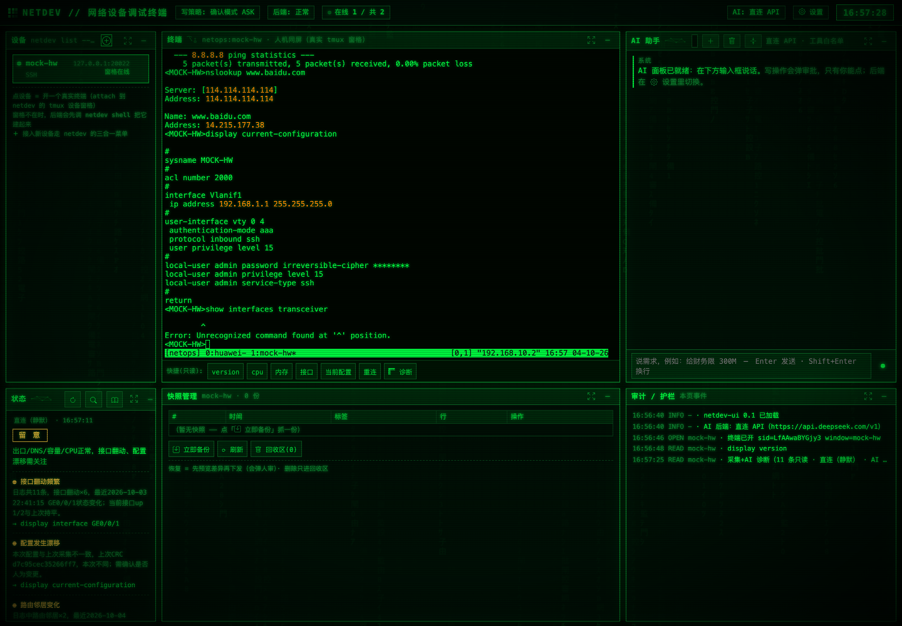
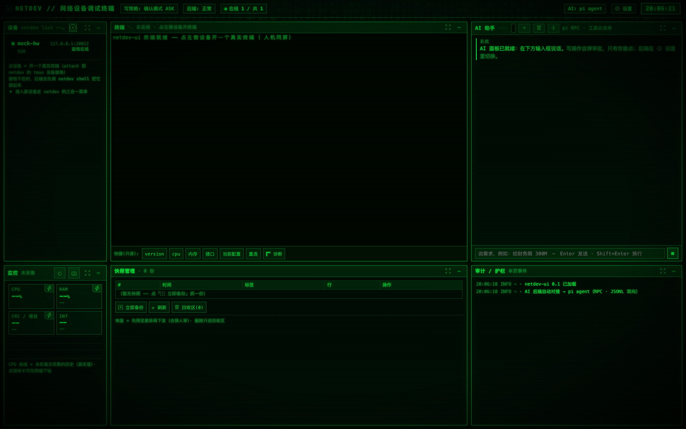

# netdev 设备工具台

[English](README.en.md) · [贡献指南](CONTRIBUTING.md) · [安全策略](SECURITY.md) · [更新日志](CHANGELOG.md) · [行为准则](CODE_OF_CONDUCT.md) · [MIT](LICENSE)

[](https://github.com/493939799-dot/netdev/actions/workflows/ci.yml)
[](LICENSE)


> CI 徽章在第一次成功跑起来后才会变绿。

一个面向 macOS 的网络设备调试终端 + AI 协作工具。它把串口 Console、SSH、Telnet 统一收敛到同一套命令行接口，并通过 tmux 实现「人机同屏」——你和 AI 看到的是同一块屏幕。

**核心原则**：所有设备操作（人工或 AI）都走同一条 CLI 路径；MCP 只负责参数翻译，绝不直接碰设备。护栏全部留在 CLI 里，AI 无法绕过。

```
┌──────────┐   ┌──────────┐   ┌──────────┐
 │  人工    │   │  网页界面  │   │    AI    │   ← 三个前门…
 └────┬─────┘   └────┬─────┘   └────┬─────┘
      │             │              │
      └─────────────┼──────────────┘
                    ▼
            ┌───────────────┐
            │  netdev CLI   │          ← …只有一扇门。护栏全在这里面。
            └───────┬───────┘
                    ▼
        ┌───────────────────────────┐
        │ 串口 · SSH · Telnet       │
        │ (tmux：人机同屏)          │
        └───────────────────────────┘
```

---

## 界面

**已接入设备** —— 点一下设备清单，同屏终端就开了；你在终端里敲的字，AI 读到的也是同一块屏。



**刚打开、还没接设备** —— 顶栏那一排是「写策略 / 后端 / 在线数 / AI 后端」，
出问题时先看它们，再看下面的审计栏。



> 「已接入」那张是一台真实的华为 AR 路由器（USB 串口接入）；「未接入」那张用的是
> 仓库自带的**本机模拟器**（`mock-hw`，模拟华为 VRP），任何人都能一键复现，
> 不需要真设备。两张图都做过脱敏：串口序列号、终端状态栏里的本机局域网 IP 已打马赛克。

---

## 功能

- **三通道接入**：串口 Console / SSH / Telnet
- **人机同屏**：基于 tmux，人工与 AI 共享同一窗格
- **四道写闸门**：黑名单分类 → 人工审批弹窗 → 强制备份 → 逐行下发并校验
- **AI 助手走直连**：直连 OpenAI 兼容 API（DeepSeek / OpenAI / OpenRouter / 任意兼容网关），一把 Key 即用，零额外 CLI 依赖；也可整体关闭 AI
- **备份与恢复**：配置快照、差异对比、回收区机制
- **网页服务一键管理**：`netdev ui`（没有就起、有就报状态），后台守护、关终端不掉
- **本地体检**：`./netdev doctor` 一键自检

## 平台

**macOS only**。当前依赖：tmux、osascript、security、launchctl、串口驱动（FTDI/CH340/CP210x）以及 macOS 特有的 `/dev/cu.*` 设备名。跨平台需要额外适配，不在当前范围内。

> 注：早期文档写的 `expect` 依赖是**误报**。全仓已核：串口/SSH/Telnet 桥均为纯 Python
> （pyserial / paramiko），没有任何 `spawn` / `expect -c` 调用。

## 开箱即用：先不用真设备看一眼

**`./netdev mock start`** —— 在 `127.0.0.1:20022` 起一个模拟华为 VRP 的设备。
然后到网页界面点「**＋ 接入**」选它，连上就能敲 `display version`。
`./netdev mock stop` 收工。

```
./netdev mock start        # 起（有就报状态，不重复起）
./netdev mock status       # 在跑 = 退出码 0；没跑 = 1
./netdev mock stop
```

它用的就是 `tests/mock_vrp.py` —— 所以**下面所有测试也是靠它离线跑的**，
任何人 clone 下来不接任何真硬件就能验证整套东西。

## 开箱即用：设备接入与监控

**平台不用懂，系统自动识别。** 接入设备时「平台」字段默认「自动识别」——连接后系统会发一条 `display version`，按厂商 banner 自动判断（华为 / 华三 / 锐捷 / 思科 / 迈普），再据此选对监控命令与解析规则。留空即可，不用记 platform 代号。

监控采集全程**静默直连**（SSH/Telnet 独立短连接，不打断前台同屏操作），命令与解析按厂商档案分派；档案未命中的指标显示「—」（绝不编造 0）。接上陌生厂商设备若指标显示「—」，用监控面板的「AI 提议解析规则」现场校准一次即可，不必改代码。

**命令是学一次、一直用的。** 某条指标命令不被设备接受时，系统会自动逐条试候选并把命中结果**落盘记住**（`config/cmd-cache.json`），下次采集直接用它、不再重复探测。悬停监控副标题可看到「已学到 N 条命令」。

## AI 助手：只需要一把 API Key

AI 助手**只有一个后端：直连 OpenAI 兼容 API**。不依赖本机装任何 AI CLI，没有常驻进程，
没有凭据文件要维护 —— 一把 Key 就能用。

配置路径（三处任选，优先级从上到下）：

1. 界面 → **设置 → 「直连 API Key」**：选服务商、粘贴 Key、点「保存并启用」
   （写入 `config/direct.json`，权限 600，已在 `.gitignore` 中排除）；
2. 环境变量：`NETDEV_DIRECT_API_KEY` + `NETDEV_DIRECT_BASE_URL`
   （可选 `NETDEV_DIRECT_MODEL` / `NETDEV_DIRECT_PROVIDER`）；
3. 手写 `config/direct.json`：`{"provider","api_key","base_url","model"}`。

配好后顶栏徽章会显示 **AI: 直连 API**。想看连通性就点设置里的「可用性检测」
（会真发一条最小 prompt）；也可以 `POST /api/direct/test`。

**AI 手里的工具就是 netdev 自己的那 13 个**（`netdev_list` / `netdev_run` /
`netdev_apply` / `netdev_save` / `netdev_backup` / `netdev_diff` / `netdev_ping` /
`netdev_serial_run` / `netdev_watch_tail` / `netdev_connect_info` /
`netdev_screen_list` / `netdev_screen_read` / `netdev_screen_send`）。
它们全部转调 netdev CLI，**写操作的四道闸门一行不改** —— AI 绕不过去。
设置里的「工具权限」可以再收一档：`read` = 不给任何工具，纯对话。

### 连不上 / 报错时先看这里

| 现象 | 真因 | 怎么办 |
| --- | --- | --- |
| `直连未配置：…` | 没配 Key，或 Key 写在环境变量里但优先级判断没生效 | 设置面板填 Key 并保存；保存后若提示"环境变量优先"，就 `unset NETDEV_DIRECT_API_KEY` |
| `HTTP 401` / `Authentication` | Key 错、已撤销、或服务商选错 | 重新粘贴；确认「接口地址」与 Key 属于同一家 |
| `HTTP 404` | 模型名不存在（或地址少/多了 `/v1`） | 点「保存并启用」旁的模型输入框，从 datalist 里选**账户实时可用**的型号 |
| 模型回应变慢/超时 | 网络或代理 | 直连走标准 HTTPS；如果本机有代理，注意直连域名要在代理放行列表里 |
| 报 "工具用不了" / 模型说没有工具 | `netdev_mcp.py` 起不来 → 工具表为空 | `python3 tests/test_ai_toolchain_and_cache.py`，第 [4][5] 组会直接指出哪个文件坏在哪一行 |

> **DeepSeek 的型号名有个坑**：`deepseek-chat` / `deepseek-reasoner` 这些"文档名"会
> 返回 **200**，但被服务端**静默映射**到 `deepseek-flash` —— 配置里写 A、实际跑 B，
> 排查时会被完全误导。所以界面里的模型候选是从 `/models` 拉的**账户实时型号**
> （如 `deepseek-flash` / `deepseek-v4-pro`），照着选即可。

### 为什么不再支持 pi / WorkBuddy 当引擎

2026-10-03 之前的版本可以借 pi agent（RPC）或 WorkBuddy agent（headless）当 AI 引擎。
两条路都拆掉了 —— 不是功能取舍，是它们各自带着一整类**与 netdev 无关的故障面**：

- **pi**：配置/凭据锁用 proper-lockfile（空目录当锁），崩溃就残留，且**宿主注入的 Node
  shim 会把 `EEXIST` 改写成别的错误码**，导致它的"陈旧锁自愈"分支被整段跳过 —— 锁永不
  过期；启动时还会跑 `npm install`，国内网络不通就崩。更关键的是：`pi 0.85.1`**根本不
  支持 MCP**，netdev 的 13 个工具其实一个都传不进去。
- **WorkBuddy**：内部服务端口冲突会**静默挂死**；凭据是宿主加密信封，第三方进程解不开；
  `--tools` 是全局白名单，会把 MCP 工具一起掐掉（得改用 `--disallowedTools`，且工具名
  必须逐个 `argv` 元素传，逗号串会静默失效）。

而直连后端把这些问题一次性消灭：零第三方 CLI、零凭据文件、零常驻进程，
护栏仍然完全复用 netdev 自己的工具层。

## 网页服务：起不来怎么办

网页界面（`http://127.0.0.1:8898`）是**一个独立的后台服务**，不是打开网页就自动有的。它没在跑时，浏览器就是「打不开」。一条命令解决：

```bash
./netdev ui          # 确保服务在跑：没有就起、已经在跑就报状态（幂等，最常用）
./netdev ui status   # 只看状态，不起服务
./netdev ui restart  # 重启
./netdev ui stop     # 停止
./netdev ui log -n 40  # 看服务日志
./netdev ui open     # 确保在跑并打开浏览器
./netdev ui install  # 装开机自启（LaunchAgent）
```

双击 `bin/设备工具台.command` 时也会**自动确保服务在跑**，菜单顶部实时显示服务状态。

**为什么以前老是「起不来」**——三个坑，现在都堵上了：

| 坑 | 症状 | 现在的做法 |
|---|---|---|
| 以前**根本没有启动入口** | 只有文档里的 `python ui/server.py`，随手一关就没了 | `netdev ui` 成为一等公民命令 |
| `ui/启动.command` 用 `exec` **前台跑** | 关掉那个终端窗口 = 服务被杀 | 改为后台守护，窗口关了照跑 |
| `launchctl bootstrap` **被本机安全策略拦** | `Bootstrap failed: 5: Input/output error`，开机自启永远装不上 | `netdev ui` 不依赖 launchd；`doctor` 也不再把这条当成故障 |

服务用 **double-fork + `os.setsid()`** 脱离当前进程组（`ui/daemonize.py`），所以终端会话、启动器窗口、甚至它的父进程结束，都不会把它带走。
`nohup … &` 做不到这一点——它仍留在原进程组里，会被连坐收掉。

**服务日志**：`logs/ui-service.log`（启动横幅含 PID 与时间戳）；**PID 文件**：`logs/ui-service.pid`。

## 两种安装方式

### 方式一：下载安装包（推荐）

**[⬇ 下载 netdev-macos-arm64-installer.tar.gz](https://github.com/493939799-dot/netdev/releases/latest/download/netdev-macos-arm64-installer.tar.gz)**（约 37 MB）

下载后，在终端里依次执行：

```bash
tar -xzf netdev-macos-arm64-installer.tar.gz
cd netdev-macos-arm64-installer
bash install.sh --dry-run   # 先预览会做什么（不写盘）
bash install.sh             # 正式安装
```

安装包**自带 Python 与全部依赖**，目标 Mac **不需要预装任何东西**，也**不需要联网**。
默认装到 `~/netops`；想换位置用 `--prefix <目录>`。

装完：双击 `~/netops/ui/启动.command`，浏览器打开 <http://127.0.0.1:8898>。
卸载：进安装目录执行 `bash uninstall.sh`（会先移入隔离区，不直接删）。

<details>
<summary>想自己从源码构建这个包？</summary>

源码仓库本身**不含** `payload/` 和 `runtime/`，直接 `bash install.sh` 会失败，需先构建分发包：

```bash
bash dist/build_bundle.sh --with-python
# 产物：~/Desktop/workbuddy/<日期>_netdev设备工具台_macOS_<arch>_安装包.tar.gz
```

构建前需准备离线依赖（否则包内不含 netmiko 等，目标机得联网装）：

```bash
uv pip install --target dist/deps --python 3.12 -r requirements.txt
```

> ⚠️ `dist/deps` 里的 `.so` 决定了包内 Python 的版本（构建脚本从中反推），
> 所以**生成依赖与构建必须用同一个 Python 小版本**，否则目标机加载 `_cffi_backend.so` 等会直接崩。
</details>

### 方式二：开发者就地运行

```bash
cd /path/to/netops

# 建 venv 并装依赖（可用 uv，也可用 requirements.txt）
uv venv --python 3.13 .venv
uv pip install -r requirements.txt

# 体检
./netdev doctor

# 启动网页界面（后台守护，关终端不掉）
./netdev ui open
# 或者：双击 ui/启动.command（同样是后台跑）
# 或者：双击 bin/设备工具台.command（会顺带确保服务在跑）
```

浏览器打开 http://127.0.0.1:8898。起不来时先跑 `./netdev ui status`，再看 [`网页服务：起不来怎么办`](#网页服务起不来怎么办)。

> 装到非 `~/netops` 路径也可以：所有入口都按 `NETDEV_ROOT` 环境变量 / 脚本自身位置推导，
> 不会硬编码家目录（`./netdev web repair` 生成的网页按钮同样按真实安装路径生成）。

## 目录结构

```
.
├── netdev              # 命令行入口
├── netdev_cli.py       # CLI 主程序
├── netdev_mcp.py       # MCP 桥（stdio / JSON-RPC）
├── ui/                 # 自带网页界面（8898）
├── lib/                # 核心库：gates、approval、creds、engine 等
├── tools/              # 桥接脚本与工具
├── config/             # 配置真身（devices.toml、connections.json…）
├── dist/               # 发行流水线：build_bundle.sh + install.sh + 离线依赖
├── backups/            # 快照与自动备份（用户数据，随安装保留）
├── logs/               # 运行留档
└── live/               # 镜像流日志
```

## 关键配置

- `config/devices.toml`：设备清单（**只写 `password_env` 变量名，不写密码**）
- `config/connections.json`：连接簿
- `config/pi-commands.json`：网页终端左栏按钮（3 条聚合入口：快速接入 / 管理接入目标 / 备份恢复）
- `config/direct.json`：直连 API Key 后端凭据（600 权限，已 gitignore，**不要提交**）
- `config/cmd-cache.json`：采集命令学习缓存（机器本地状态，可随时删）
- `config/AGENTS.workspace.md`：给 AI 的操作约定（**本机文件，已 gitignore**）。
  开源仓里提供脱敏模板 `config/AGENTS.workspace.md.example`：
  `cp config/AGENTS.workspace.md.example config/AGENTS.workspace.md` 后按你的环境改。

## 安全

- 写操作强制备份、逐行校验、失败即停（fail-closed）
- **审批通道不可达时拒绝执行**，不是放行
- 破坏性操作先进隔离区，再按需物理删除
- 审批代码 `lib/approval.py` 带 sha256 基线篡改检测，被悄悄改过 `netdev doctor` 会报
- AI 后端默认只能调用只读工具 + 13 个 `netdev_*` 工具；Bash/Write/Edit 等硬移除
- 凭据文件不入版本库：`config/direct.json`、`config/*token*.json`、`config/*key*.json` 已在 `.gitignore` 中排除
- ⚠️ 服务只监听 `127.0.0.1` 且**无鉴权** —— 改成 `0.0.0.0` 对外暴露等于把设备交出去

完整信任边界见 [SECURITY.md](SECURITY.md)。

## 自检

```bash
./netdev selftest                                       # 端到端自检（打本机模拟器，不需要真设备）
./netdev doctor                                         # 环境 / 服务 / 串口 / 命令清单 / 日志
python3 tests/test_ai_toolchain_and_cache.py           # 回归：AI 工具链一致性 + MCP 握手 + 采集缓存 + 平台识别（57 项）
python3 tests/test_approval_gates.py                   # 回归：写操作人审闸门（19 项，安全关键）
python3 tests/test_mock_cmd.py                         # 回归：netdev mock 模拟器命令 + 行编辑语义（21 项）
python3 tests/test_ui_lifecycle.py                     # 回归：网页服务起停 / 幂等 / 真脱离进程组（27 项）
```

> 上面几项测试**全部离线**，不需要真设备、不需要网络、不需要凭据 ——
> 仓库自带华为 VRP 模拟器（`tests/mock_vrp.py`）。CI 每次 push 都跑。

`test_approval_gates.py` 守的是最要紧的一处：它是唯一决定"AI 能不能改设备"的地方。
其中最关键的一条断言是 **「豁免开关打开时，真机仍然不免人审」** ——
豁免只对 `devices.toml` 里标了 `sim = true` 且 host 是回环地址的本机模拟器生效
（只为让 `selftest` 能在没有 GUI 的 CI 上跑），真实设备永远走人审。

`test_ui_lifecycle.py` 跑在 **8899** 端口 + 临时 PID/日志文件，**不会碰你正在用的 8898 实例**。
它守的是「关掉终端服务就死」这个根因：断言服务进程与调用方**不在同一进程组**——
`nohup … &` 过不了这一条，`double-fork + setsid` 才能过。

## 参与贡献

- 改之前请读 [CONTRIBUTING.md](CONTRIBUTING.md) —— 里面写了**三条不可让步的架构约束**
  （所有设备操作走同一条 CLI 路径 / 闸门必须 fail-closed / 破坏性操作只搬不删），
  动到它们请在 PR 里专门解释。
- 发现安全问题请**别开 public issue**，见 [SECURITY.md](SECURITY.md)。
- **维护者要发布/更新这个仓库时**：双击 `bin/开源.command`。
  它会先做泄密自检（真机清单、密码、日志都不在提交列表里），再一步步带你走完
  建仓与上传；加 `--dry` 参数可以只体检、什么都不改。

## 许可

[MIT License](LICENSE)
